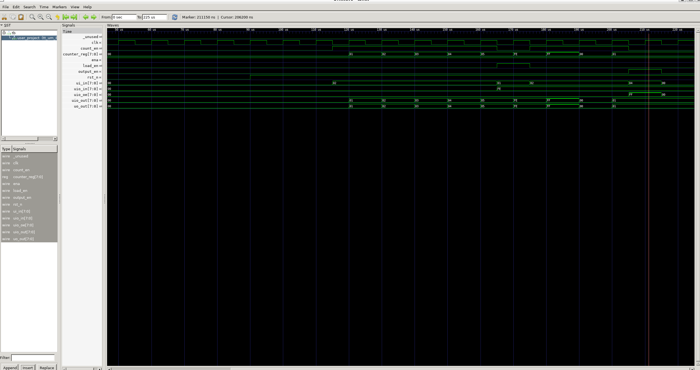

# 8-Bit Loadable Counter with Bidirectional I/O

An 8-bit synchronous up-counter implemented in Verilog for [Tiny Tapeout](https://tinytapeout.com). It features an asynchronous active-low reset, synchronous parallel load, count enable, and bidirectional I/O control.

---

## How It Works

The core of the design is an 8-bit register (`counter_reg`) updated on the rising edge of `clk` (or asynchronously cleared by `rst_n`).

### Operational Modes & Priority:

1. **Reset (`rst_n = 0`):**
   * Asynchronously clears the counter to `8'h00`.
2. **Parallel Load (`load_en = 1`):**
   * Takes highest priority during normal operation. 
   * On the rising edge of `clk`, loads the 8-bit data present on `uio_in[7:0]` directly into `counter_reg`.
3. **Count Up (`count_en = 1`, `load_en = 0`):**
   * Increments `counter_reg` by 1 on every rising clock edge. Wraps around from `0xFF` to `0x00`.
4. **Hold (`count_en = 0`, `load_en = 0`):**
   * Holds the current value indefinitely.

### Output Behavior:
* **Dedicated Outputs (`uo_out[7:0]`):** Continuously drives the current 8-bit counter value.
* **Bidirectional Pins (`uio[7:0]`):** Controlled by `output_en` (`ui_in[2]`):
  * `output_en = 0`: Pins act as high-impedance inputs (`uio_oe = 8'h00`), allowing you to supply external data to `uio_in` for loading.
  * `output_en = 1`: Pins act as outputs (`uio_oe = 8'hFF`), mirroring the counter value onto `uio_out`.

---

## Control Truth Table

| `rst_n` | `load_en` (`ui[0]`) | `count_en` (`ui[1]`) | Next State (`counter_reg`) | Description |
| :---: | :---: | :---: | :---: | :--- |
| `0` | `X` | `X` | `8'h00` | Asynchronous Reset |
| `1` | `1` | `X` | `uio_in[7:0]` | Synchronous Parallel Load |
| `1` | `0` | `1` | `counter_reg + 1` | Increment |
| `1` | `0` | `0` | `counter_reg` | Hold |

---

## Pinout

### Dedicated Inputs (`ui_in`)
| Pin | Name | Description |
| :--- | :--- | :--- |
| `ui_in[0]` | `load_en` | Active-high parallel load enable |
| `ui_in[1]` | `count_en` | Active-high count enable |
| `ui_in[2]` | `output_en` | Bidirectional pin output enable (`1` = Output, `0` = Input) |
| `ui_in[7:3]` | *Unused* | Tied off internally |

### Dedicated Outputs (`uo_out`)
| Pin | Name | Description |
| :--- | :--- | :--- |
| `uo_out[7:0]` | `counter_reg[7:0]` | Counter value (Bit 0 to Bit 7) |

### Bidirectional I/O (`uio`)
| Pin | Direction | Description |
| :--- | :--- | :--- |
| `uio[7:0]` | Input (when `output_en = 0`) | 8-bit parallel data to load into the counter |
| `uio[7:0]` | Output (when `output_en = 1`) | Mirrors the 8-bit counter output |

> ⚠️ **Warning:** Ensure `output_en` (`ui_in[2]`) is set to `0` before driving signals onto `uio` from an external source to prevent bus contention.

---

## How to Test

### Simulation
Run the testbench using Cocotb:

```sh
# Run standard RTL simulation
make -B

# Run gate-level simulation (after hardening)
make -B GATES=yes
```

